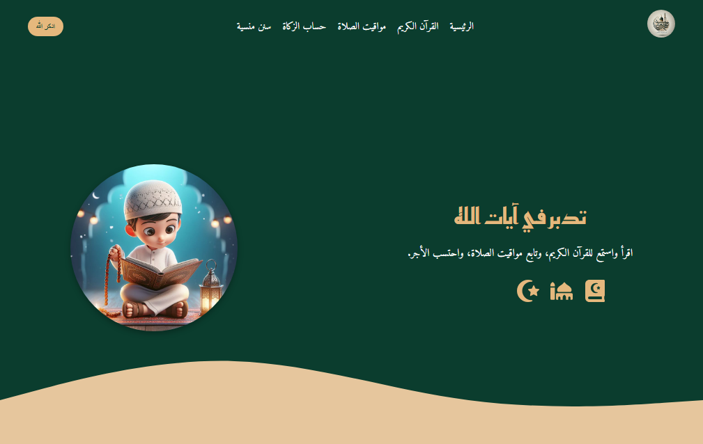

# 🕌 Jannat Al-Zikr

### Reflect • Learn • Remember • Strengthen Your Faith

A modern and responsive Islamic website built with **React, JavaScript, and Vite**.

---

## ✨ About The Project

**Jannat Al-Zikr** is a modern Islamic website designed to provide a simple and accessible digital experience for Muslims.

The project brings together useful Islamic resources and interactive features in one place, including Quran browsing and listening, prayer times, Zakat calculation, Islamic Sunnahs, prayer and Wudu guides, and an interactive Islamic quiz.

The website focuses on a clean interface, smooth navigation, responsive design, and integration with external APIs to provide dynamic Islamic content.

---

## ✨ Features

* 🕌 Modern Islamic website interface
* 📱 Fully responsive design
* 📖 Quran Surahs browsing
* 🎧 Quran audio playback
* 📜 Surah information
* 🕋 Prayer times for different Arab countries
* 🌍 Country selection for prayer times
* 💰 Zakat calculator
* 🟡 Gold and silver Zakat calculation
* 🌾 Agricultural crops Zakat calculation
* 🐄 Livestock Zakat section
* 💧 Step-by-step Wudu guide
* 🕌 Step-by-step prayer guide
* 📖 Prophets' supplications section
* 🌙 Forgotten Sunnahs section
* 🎯 Interactive Islamic quiz
* ⏱️ Timed quiz questions
* 🎲 Random Sunnah feature
* 🧭 React Router navigation
* ✨ Interactive UI
* 📱 Responsive mobile navigation

---

## 📖 Quran Section

The Quran section allows users to explore the Holy Quran through an interactive interface.

Users can:

* 📚 Browse all Quran Surahs
* 🎧 Listen to Surah recitations
* 📜 View Surah information
* ▶️ Play and pause audio
* 📱 Browse the Quran comfortably across different screen sizes

Quran data and Surah information are loaded dynamically using external APIs.

---

## 🕌 Prayer Times

The website provides prayer times based on the selected Arab country.

Users can:

* 🌍 Select a country
* 🕐 View daily prayer times
* 🔄 Automatically update prayer times when changing the country

Prayer times are retrieved dynamically using the **AlAdhan API**.

---

## 💰 Zakat Calculator

Jannat Al-Zikr includes an interactive Zakat calculator for different types of wealth and assets.

The calculator includes:

* 💵 Money
* 🟡 Gold
* ⚪ Silver
* 🌾 Agricultural crops
* 🐄 Livestock
* 💧 Different irrigation methods for crops

Users can enter their values and receive the calculated Zakat amount based on the selected category.

---

## 💧 Prayer & Wudu Guides

The project includes visual guides to help users learn the steps of:

* 💧 Wudu
* 🕌 Prayer

The guides use image galleries to present the steps in an organized and easy-to-follow format.

---

## 🌙 Forgotten Sunnahs

The Sunnahs section provides users with a collection of Islamic Sunnahs and related information.

Users can:

* 📖 Read different Sunnahs
* 🎲 Discover a random Sunnah
* ✨ Explore useful daily practices

---

## 🎯 Islamic Quiz

Jannat Al-Zikr also includes an interactive Islamic quiz designed to make learning more engaging.

The quiz includes:

* ❓ Randomly selected questions
* ⏱️ Countdown timer
* ✅ Answer validation
* 📊 Score tracking
* 🔄 Multiple questions
* ✨ Interactive animations

---

## 📱 Responsive Design

Jannat Al-Zikr is designed to provide a smooth experience across:

* 💻 Desktop
* 💻 Laptop
* 📱 Tablet
* 📱 Mobile

The layout adapts to different screen sizes while maintaining usability and a consistent interface.

---

## 🔌 APIs & External Services

The project integrates external services to provide dynamic content:

* 📖 **Al Quran Cloud API** — Quran Surah data
* 🕌 **AlAdhan API** — Prayer times
* 📜 **Quran.com API** — Surah information
* 🎧 **MP3 Quran** — Quran audio recitations

---

## 🛠️ Technologies Used

---

## 🎯 Project Purpose

This project was created as a **React frontend practice project** to improve web development skills and gain practical experience with:

* React components
* React Hooks
* State management
* React Router
* API integration
* Fetching dynamic data
* Interactive UI development
* Responsive web design
* JavaScript logic
* Reusable components
* External API integration
* Building a complete React application

---

## 👩‍💻 Author

**Asmaa Qandil**

Frontend Developer • React & JavaScript Learner

---

## 🤍 Acknowledgment

Built with passion for Islamic learning, clean design, and frontend development.
